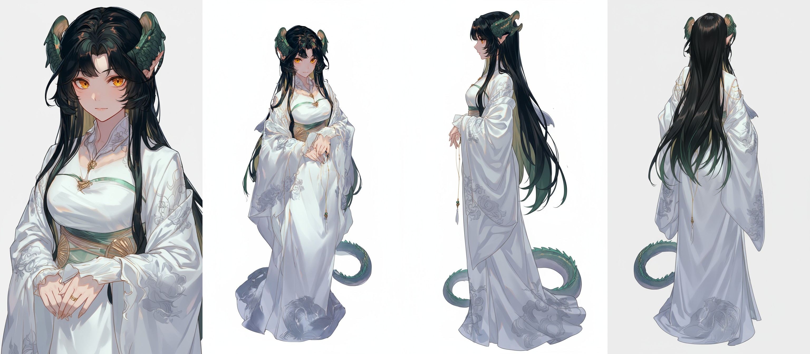

# 分享记录 1756779241686_je10ot

## 提示词

```
主体：图像1的女子
动作与表情：她看向屏幕左侧，微微歪头，嘴角上扬，似乎很得意。她的左臂弯曲，应该刚刚检查过手腕上的黑色数字手表。
背景：一个模糊的室内环境，左侧有一堵绿蓝色的墙，右侧有一个较浅、模糊的区域。
构图：单人占据大半个屏幕。
视角：人物上半身胸像特写。
```

> 用户名: 饮水机管理员

## 输入图片





## 生成结果


## 结果文本

### Part 1

```
这里是您想要的图片： 
```
