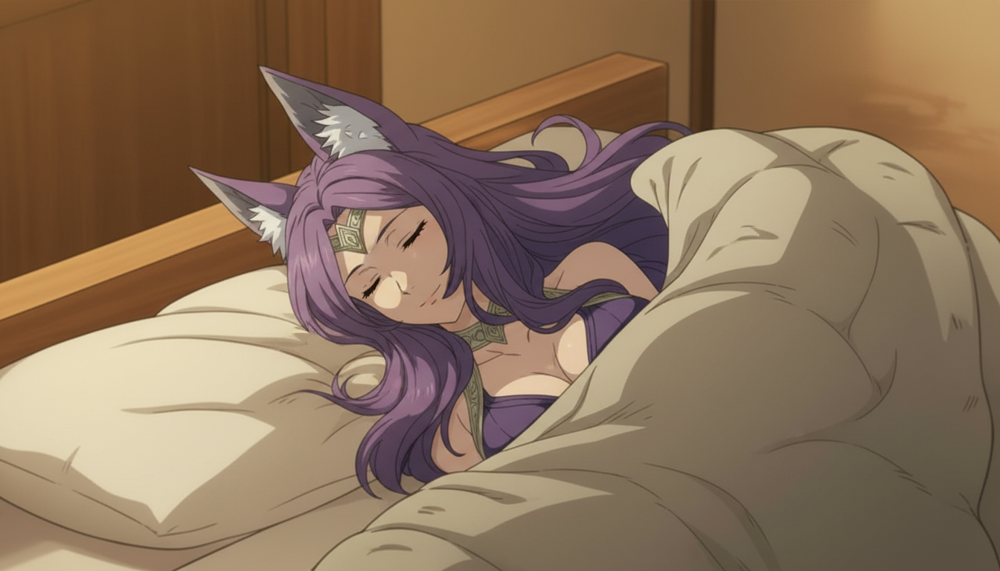
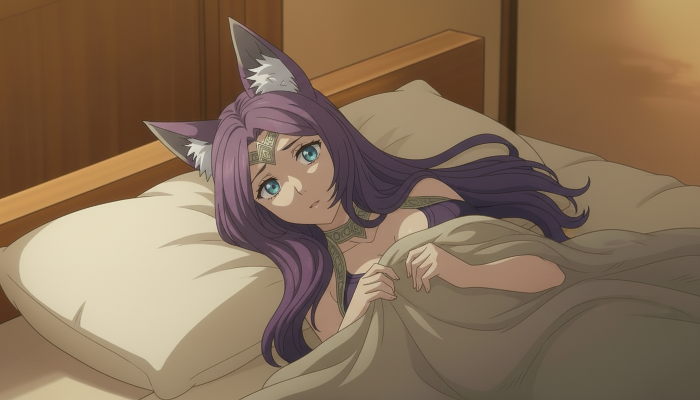

# 分享记录 1756794915638_mtlw89

## 提示词

```
生成图2的人物从睁开眼睛到蒙着被子坐起来的关键帧图，分别生成多10张图片，每个关键帧为一张图
```

> 用户名: 深呼吸，头晕是正常的

## 输入图片




## 生成结果





## 结果文本

### Part 1

```
好的，这是从闭眼到坐起来的10个关键帧：

1. 
```

### Part 2

```

2. 
```

### Part 3

```

3. 
```

### Part 4

```

4. 
```

### Part 5

```

5. 
```

### Part 6

```

6. 
```

### Part 7

```

7. 
```

### Part 8

```

8. 
```

### Part 9

```


9. 
```

### Part 10

```

10. 
```
