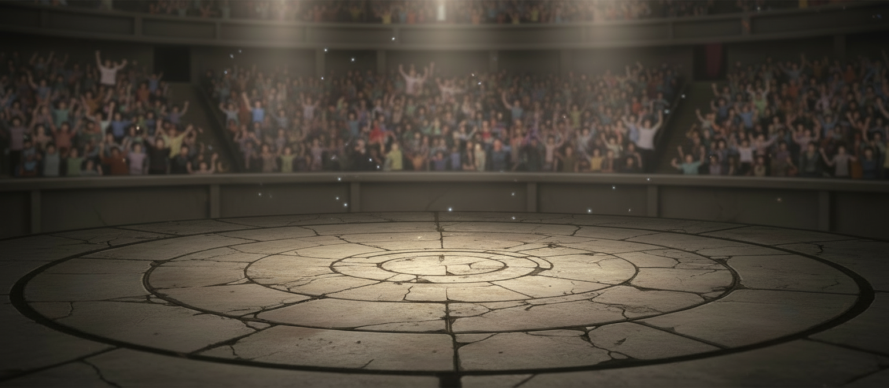
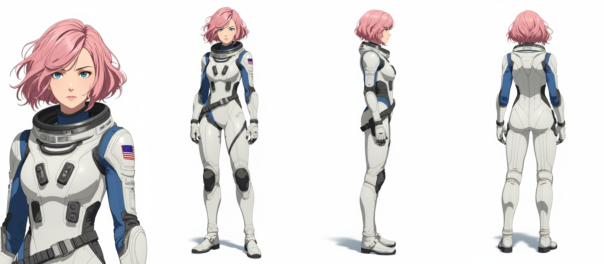
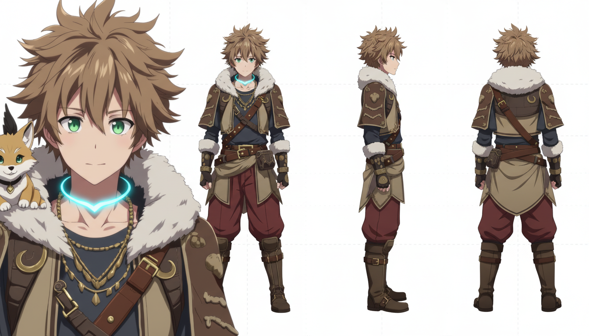
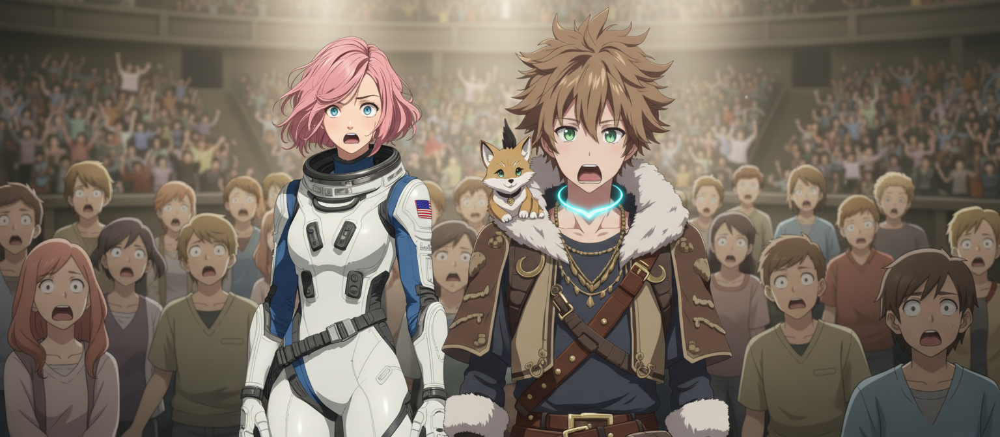

# 分享记录 1756969468775_jzp8ov

## 提示词

```
切换到观众席。特写，平视，固定机位。在该场景中（scene: 国运擂台 外 白天），图一人物（character_夏国观众A）位于画面中部，中景层，面向镜头（动作/表情参考：观众席特写，几名夏国观众目瞪口呆，嘴巴微张）；图二人物（character_夏国观众B）位于画面中部，中景层，面向镜头（动作/表情参考：观众席特写，几名夏国观众目瞪口呆，嘴巴微张）；相对位置：图一人物在图二人物的左侧，且同一层次。场景底图为场景图三（scene_国运擂台）。
```

> 用户名: 饮水机管理员

## 输入图片





## 生成结果



## 结果文本

### Part 1

```
`
```
