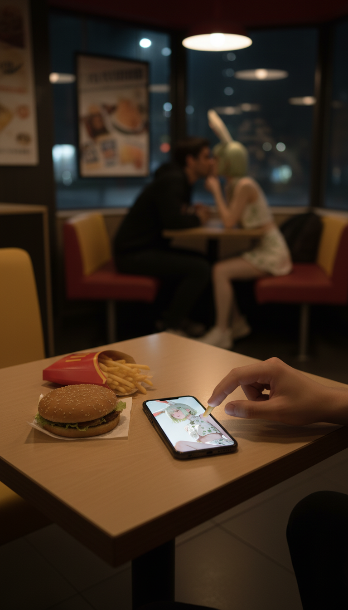

# 分享记录 1756834261046_uk4ph1

## 提示词

```
A cinematic scene inside a fast food restaurant at night.
Foreground: a lonely table with burgers and fries, and a smartphone shown large and sharp on the table, clearly displaying the uploaded anime/game character image.
A hand is reaching for food, symbolizing solitude.
	
Midground: in the blurred background, a couple is sitting together and kiss.
One of them is represented as a cosplayer version of the uploaded character:
- If the uploaded character is humanoid, show accurate cosplay with hairstyle, costume, and signature props.
- If the uploaded character is non-humanoid (mecha, creature, mascot, etc.), show a gijinka (humanized cosplay interpretation) that carries clear visual cues, costume colors, and props from the reference image (armor pieces, wings, ears, weapon, or iconic accessories).
```

> 用户名: banana

## 输入图片


## 生成结果


