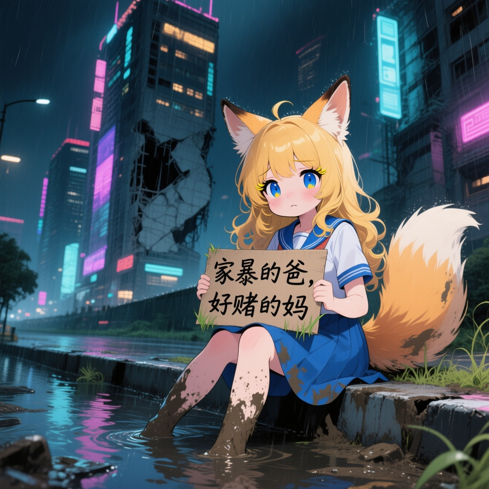
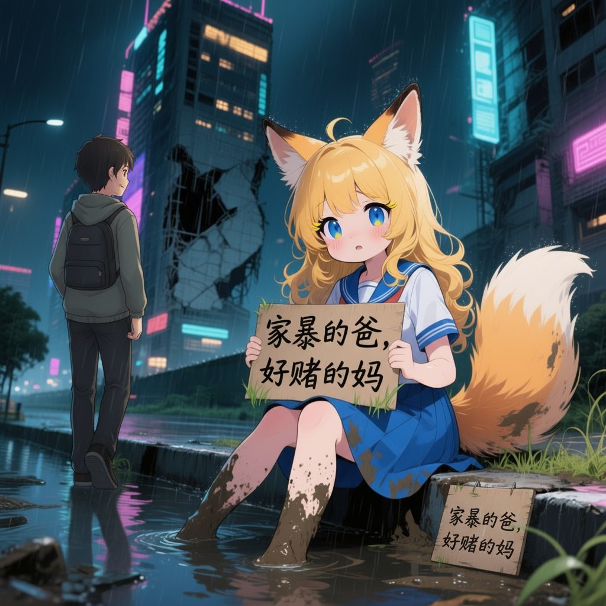
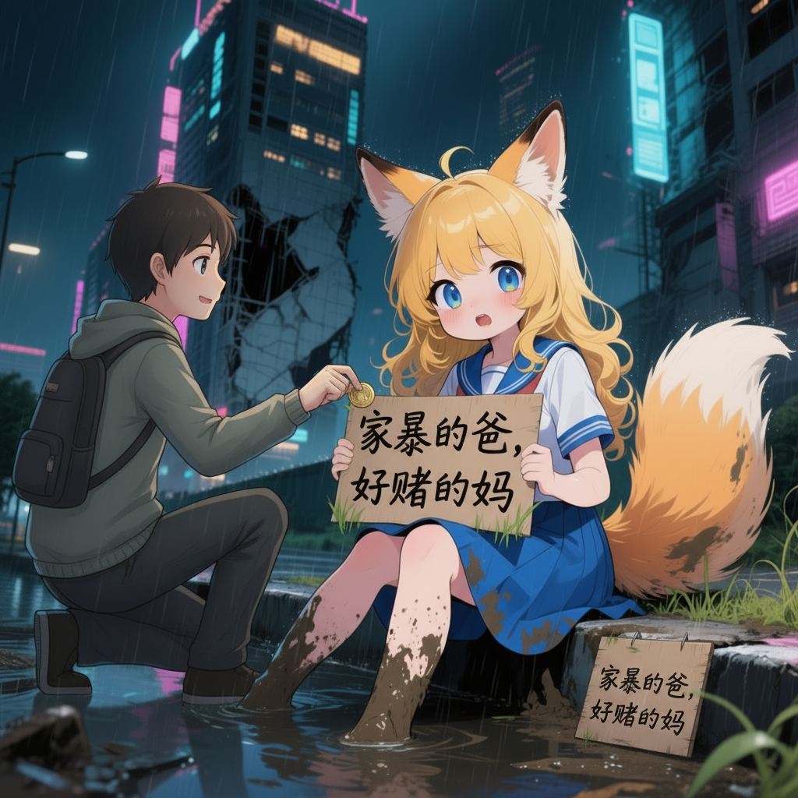
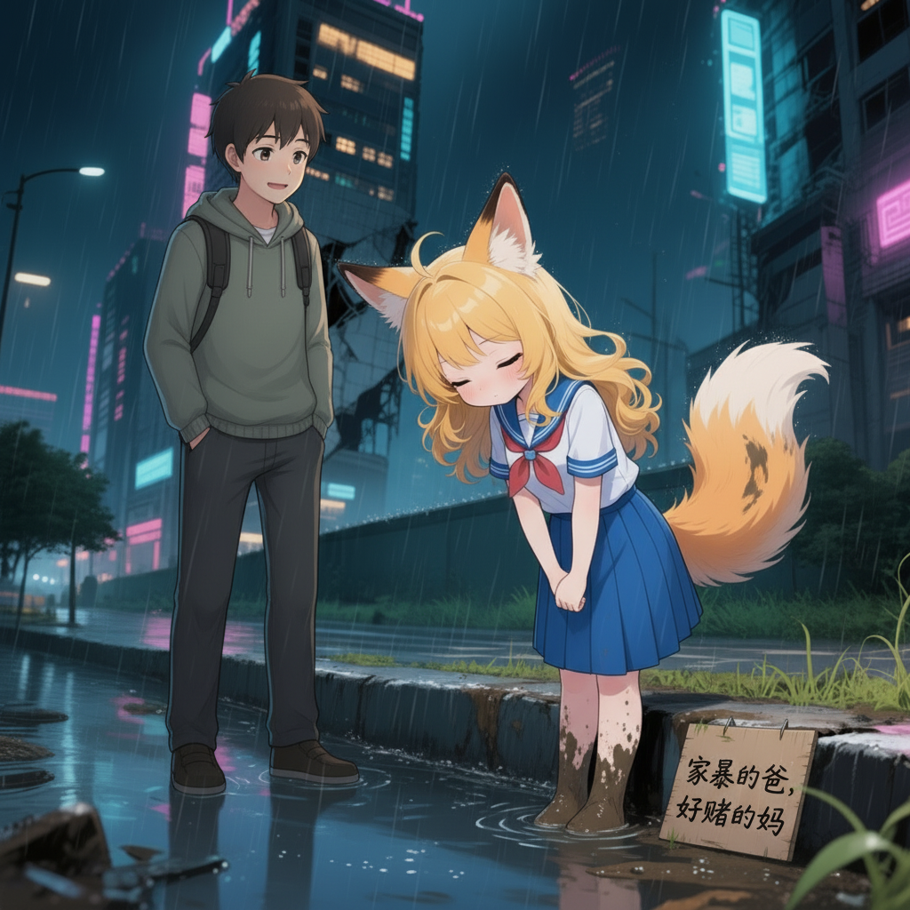
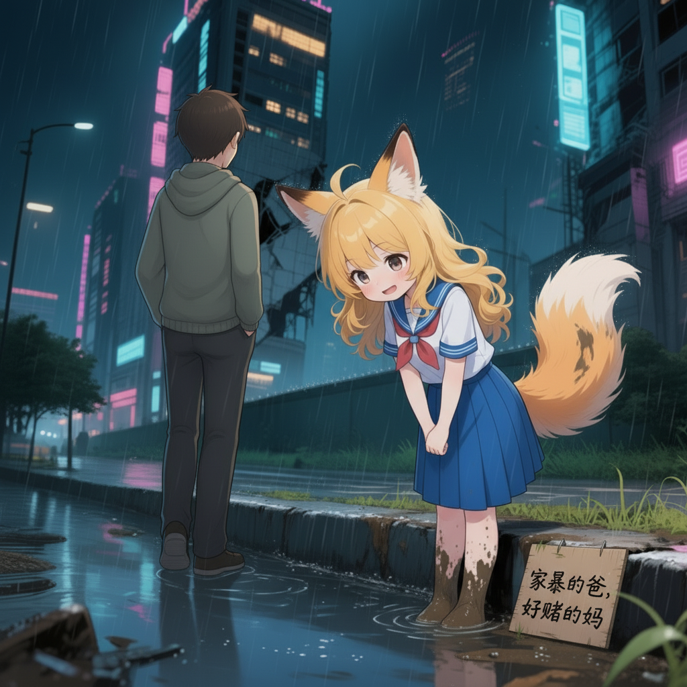

# 分享记录 1756706725858_g4u398

## 提示词

```
Generate 4 consecutive story images of the same characters and setting, keeping the signboard text unchanged.

Image 1: A man arrives in the scene.  
Image 2: The man inserts a coin for the girl, and the girl looks up at him.  
Image 3: The girl stands and bows politely to thank him.  
Image 4: The man turns and leaves, walking away from the scene.  

Keep the visual style consistent across all images. The characters should remain recognizable as the same individuals throughout the sequence.
```

> 用户名: zheyong

## 输入图片



## 生成结果






## 结果文本

### Part 1

```
Okay, here's the four-image story sequence you requested, keeping the character, setting, and signboard text consistent:

**Image 1: A man arrives in the scene.**

```

### Part 2

```
**Image 2: The man inserts a coin for the girl, and the girl looks up at him.**

```

### Part 3

```
**Image 3: The girl stands and bows politely to thank him.**

```

### Part 4

```
**Image 4: The man turns and leaves, walking away from the scene.**

```
