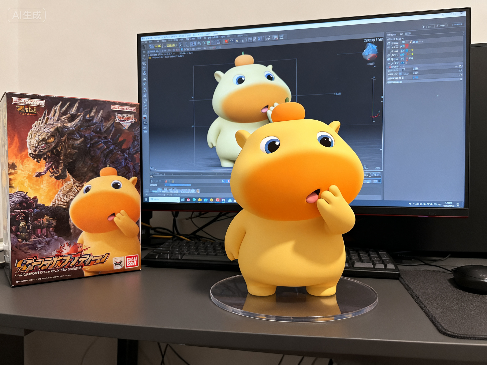
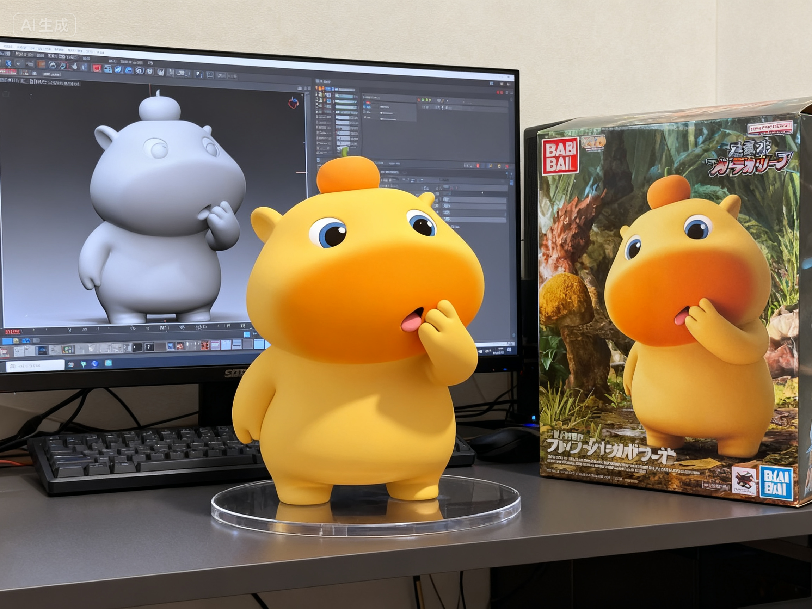
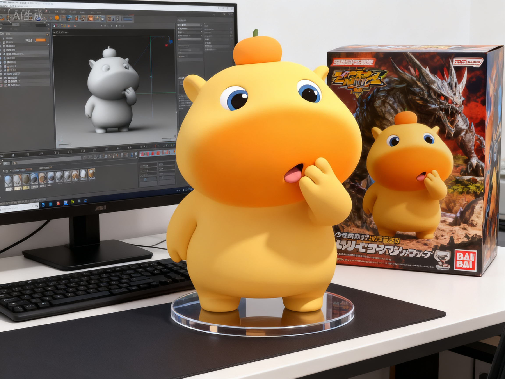
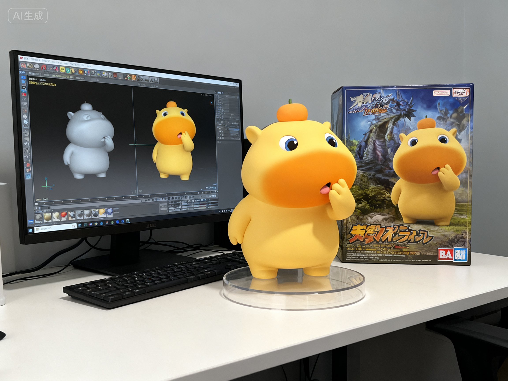

# 分享记录 1757649656944_cq55k5

## 提示词

```
create  a 1/7 scale commercialized figure of thecharacter in the illustration, in a realistic styie and environment.Place the figure on a computer desk, using a circular transparent acrylic base
without any text.On the computer screen, display the ZBrush modeling process of the figure.Next to the computer screen, place a BANDAl-style toy packaging box printedwith the original artwork.
```

> 用户名: zheyong

## 输入图片


## 生成结果





